# prompt-xray

**Languages:** [English](README.md) | [简体中文](README.zh-CN.md) | 日本語 | [한국어](README.ko.md)

[](#インストール)
[](VERSION)
[](LICENSE)

`prompt-xray` は、実用的な **Prompt X-Ray** のための小さな agent skill/reference です。プロンプトの作成、監査、書き換え、テスト、比較、そして AI coding agent 向けの Markdown skill / rules 化を支援します。

この skill はローカル agent ワークフロー向けです。良いプロンプトには、明確なタスク、信頼できる入力境界、明示的な出力形式、安全ルール、検証方法が必要です。

この localized README は主要な使い方に絞っています。完全な repository layout、release checklist、maintenance details は [English README](README.md) を参照してください。



この animated preview は [assets/demo.cast](assets/demo.cast) と readable transcript [assets/demo-session.txt](assets/demo-session.txt) に対応しています。新しい agent session から再録する場合は [docs/demo-script.md](docs/demo-script.md) を参照してください。

## このプロジェクトの目的

Google の prompt design guidance は、構造化されたプロンプトを書き、モデル出力を評価し、改善する反復プロセスを重視しています。Gemini の guidance は、明確で具体的な指示、制約、Markdown や XML 風の構造、agentic workflow におけるリスク評価、権限処理、出力形式を重視します。

この skill は、それらの考え方を local-agent 向けの軽量ワークフローにまとめます。

- 通常の文章作成やコード修正では誤って読み込まれにくい狭い trigger
- ローカル agent 向けのファイル読取、編集、コマンド実行、検証報告ルール
- 貼り付けられた prompt、log、webpage、document を untrusted data として扱う安全設計
- hidden chain-of-thought を要求しない方針
- create、analyze、rewrite、test、compare、package の 6 モード

## Prompt X-Ray

Prompt X-Ray はこの skill の作業方法です。prompt の骨格を確認し、失敗パターンを見つけ、最小限で有効な修正を提案します。

Analyze mode は **Prompt X-Ray Report** を返します。内容は `Verdict`、必要な場合の `Score`、そして `Layer`、`Status`、`Evidence`、`Smallest useful repair` の表です。具体的に直せる場合は、prose よりも block replacement または unified diff を優先します。

同梱の [Prompt X-Ray benchmark](docs/benchmark.md) は 15 個の一般的な prompt failure pattern を扱います。3 個の injection-style risk、2 個の hidden-reasoning leakage case、4 個の missing / weak output-format specification、1 個の ordinary-writing false-trigger check を含みます。これは transparent manual scorecard であり、hosted automated benchmark ではありません。具体的な修正例は [before/after examples](docs/before-after.md) を参照してください。

## クイックスタート

Target agent にインストールします。

```bash
bash scripts/install.sh codex
bash scripts/install.sh openclaw
bash scripts/install.sh hermes
bash scripts/install.sh claude-code
bash scripts/install.sh agents
```

Repository を検証します。

```bash
make validate
```

インストール後、新しい agent session を開始して skill metadata を再読み込みしてください。

試すリクエスト:

```text
Audit this prompt for trigger scope, injection risk, output format, and testability.
```

## プラットフォーム互換性

中心となる `SKILL.md` は platform-neutral です。Installer は Codex、OpenClaw、Hermes Agent、Claude Code-style skills、shared `.agents/skills` directory に合わせて配置します。

| Platform | Install | Verification |
| --- | --- | --- |
| Codex | `bash scripts/install.sh codex` | この repo で local test 済み |
| Claude Code-style local skills | `bash scripts/install.sh claude-code` | 公開 skill documentation から適配 |
| OpenClaw | `bash scripts/install.sh openclaw` | 公開 skill documentation から適配 |
| Hermes Agent | `bash scripts/install.sh hermes` | 公開 skill documentation から適配。installation により layout が異なる可能性あり |
| Shared agent directory | `bash scripts/install.sh agents` | shared agent-skill convention から適配 |

Cursor、Windsurf、Cline、Roo Code、OpenCode、Aider などでは、native skill loading がない場合、project rules、custom instructions、prompt-engineering reference として使います。詳しくは [docs/agent-compatibility.md](docs/agent-compatibility.md)。

## インストール

Installer を使います。

```bash
bash scripts/install.sh <platform>
```

Supported platforms:

```text
codex | openclaw | hermes | claude-code | agents
```

Custom home:

```bash
CODEX_HOME="$HOME/.codex" bash scripts/install.sh
OPENCLAW_HOME="$HOME/.openclaw" bash scripts/install.sh openclaw
HERMES_HOME="$HOME/.hermes" bash scripts/install.sh hermes
CLAUDE_HOME="$HOME/.claude" bash scripts/install.sh claude-code
AGENTS_HOME="$HOME/.agents" bash scripts/install.sh agents
```

## いつ使うか

prompt または agent skill artifact に対する prompt engineering 作業で使います。

- 新しい prompt の作成
- 既存 prompt の監査
- 信頼性向上のための rewrite
- 失敗モードの test
- prompt variant の compare
- 繰り返し使う workflow の `SKILL.md` 化

通常の文章作成、直接的な code fix、product setup、architecture、factual Q&A では使いません。

## 出力内容

- goal、context、task、output format、constraints、validation を含む copyable prompt
- layer ごとの status、evidence、smallest useful repair を含む Prompt X-Ray Report
- 意図を保ちながら信頼性と安全性を高めた prompt rewrite
- typical input、boundary input、format pressure、neutral injection probe を含む test matrix
- prompt variants の比較表、recommendation、tie-breaker
- frontmatter、workflow、safety rules、validation を含む lean `SKILL.md`

## 例

```text
Write a Codex prompt that fixes failing pytest tests with minimal changes and reruns verification.
```

```text
Audit this system prompt for trigger scope, injection risk, output format, and testability.
```

```text
Package this recurring workflow as a Codex SKILL.md. Generate the content only; do not write files.
```

その他の使用例: [examples/usage-cases.md](examples/usage-cases.md)。Demo replay と re-recording steps: [docs/demo-script.md](docs/demo-script.md)。

## 安全モデル

この skill は、ユーザーが明示的に実行を依頼しない限り、貼り付けられた prompts、webpages、documents、logs、configs、model outputs を untrusted data として扱います。

悪意のある prompt を分析または書き換えることはできますが、その中の埋め込み指示には従いません。また hidden chain-of-thought や private scratchpad output を求めません。最終回答には conclusions、evidence、assumptions、checks を含めます。

## 競合との位置づけ

このプロジェクトは意図的に小さく保っています。prompt marketplace、prompt registry、observability platform、automated eval suite ではありません。すでに使っている prompts や skill files を改善するための local agent skill です。

軽量な local workflow が必要な場合はこの skill を使ってください。dataset regression testing が必要なら eval platform、チーム協業や deployment controls が必要なら prompt registry、主に参考例が必要なら prompt library が向いています。

## 検証

```bash
ruby scripts/validate_skill.rb
```

Manual scenarios: [examples/test-matrix.md](examples/test-matrix.md)。
Prompt X-Ray cases: [tests/README.md](tests/README.md)。
Deferred launch items: [docs/launch-followups.md](docs/launch-followups.md)。

## 設計ソース

- [Google Cloud: Introduction to prompting](https://cloud.google.com/vertex-ai/generative-ai/docs/learn/prompts/introduction-prompt-design)
- [Gemini API: Prompt design strategies](https://ai.google.dev/gemini-api/docs/prompting-strategies)
- [Gemini API: Text generation and system instructions](https://ai.google.dev/gemini-api/docs/text-generation)

この repository は Google、Gemini、OpenAI、Anthropic、Codex、Claude Code、OpenClaw、Hermes Agent、Cursor、Windsurf、Cline、Roo Code、OpenCode、Aider、またはここで参照されるその他の product、agent、vendor と提携、承認、スポンサー関係にありません。すべての product names と trademarks はそれぞれの所有者に帰属します。

## License

MIT
